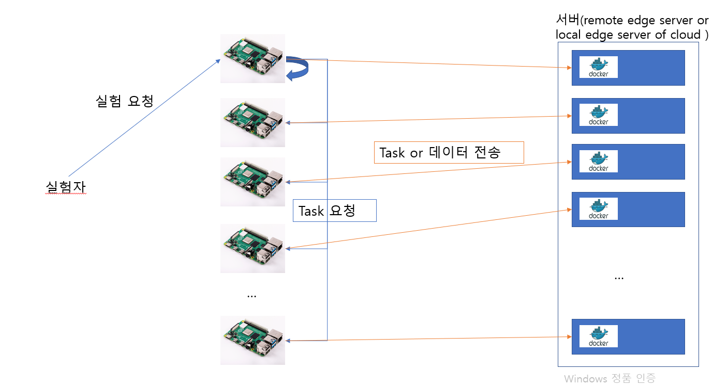

DOM Client Readme
* client folder 
    * client_app_image.py : APi and functions related to Image inference 
    * client_batch_zip.py : Compress and transfer the image by dividing it into batches
    * client_combine.py : Experiment-related api and functions that transmit image data and image data together
    * client image.py : APi and functions related to image transfer 
    * client_mqtt.py : APi and functions related to mqtt transfer
    * client_socket.py : APi and functions related to transmission using sockets 
    * client_text.py : APi and functions related to text data transfer
    * client_video.py : APi and functions related to video data transfer 
* app.py : main (run)
* client_request.py : Request related code
* config.py : Setting the config value by device (git ignore)
    ```
    IP = {
    'video_path': '/home/dom/dom/videos/',  # Location where image data is stored
    'img_path' : '/home/dom/dom/images/',   # Location where the image data is stored
    'server': '155.230.36.27:50011', # DOM: Server address to send data / due to the current DOM structure, the address is different for each device, so it is necessary to set it separately for each device.
    'clients':['155.230.36.58','155.230.36.220','155.230.36.221','155.230.36.222','155.230.36.241','155.230.36.248','155.230.36.250','155.230.36.244','155.230.36.249','155.230.36.242','155.230.36.243','155.230.36.245','155.230.36.246','155.230.36.247','155.230.36.251','155.230.36.252','155.230.36.253'],# DOM: Write the entire IP only on the device to be controlled, and you don't have to pay attention to the rest of the devices.
    'socket_host': '59.27.74.76', # Server IP, changing by device when sending sockets
    'socket_post' : '50025',  # Server port, changing by device when sending sockets
    }
    ```
* image_classification.py : Image inference code
* videoCompress.py : Image compression code -> Compress the image with ffmpeg rather than zip, reducing the capacity of the image itself.
* socket_client.py : Socket transfer(udp, tcp)
* update_device.py : Update full Raspberry pi's code (git)


## How server and client work



## TIP
---
* If IP is changed, change the dom IP of /etc/hosts/ of the PI device.


* Resolve general account git pull permissions
sudo chmod a+rwx .git/FETCH_HEAD

* Save gitlab id/password
git config --global credential.helper store

* API Curl Command Example

```
To all devices (video) 
curl -d "limit=16&is_zip=T" -X POST http://ip:port/upload_all_video
To one device (video)
curl -d "limit=16" -X POST http:ip:port/upload_video
To one device (Video compression)
curl -d "limit=16" -X POST http:ip:port/upload_video_zip

To all devices (Compress the entire video at once) limit remains the same (40)
curl -d "limit=16" -X POSt http:ip:port/upload_all_video_zip
To one device(Compress the entire image at once)
curl -d "limit=16" -X POST http:ip:port/upload_zip_all

To all devices (image)
curl -d "img_cnt=10000&is_predict=F&is_zip=F" -X POST http:ip:port/upload_all_img
To one device (image)
curl -d "img_cnt=10000&is_predict=T" -X POST http:ip:port/upload_image
To one device(image compression)
curl -d "img_cnt=10000&is_predict=T" -X POST http:ip:port/upload_image_zip

To all devices (Compress the entire image at once)
curl -d "img_cnt=10000" -X POSt http:ip:port/upload_all_img_zip
To one device(Compress the entire image at once)
curl -d "img_cnt=10000" -X POST http:ip:port/upload_img_zip_all

To all devices (Image batch compression)
curl -d "img_cnt=10000&batch=2" -X POST http://ip:port/upload_batch_img_zip
curl -d "img_cnt=10000&batch=2" -X POST http://ip:port/upload_img_zip_batch

To all devices (Data heterogeneity) : 
if img_cnt == 0, video 100%
if limit == 0, img 100%
curl -d "img_cnt=80000&limit=16" -X POST http://ip:port/upload_hetero

To all devices (mqtt, video)
curl -d "limit=16" -X POST http://ip:port/upload_all_video_mqtt
To one device (mqtt, video)
curl -d "limit=16" -X POST http:ip:port/upload_video_mqtt

To all devices(mqtt, image)
curl -d "img_cnt=10000" -X POST http://ip:port/upload_all_image_mqtt
To one device (mqtt, image)
curl -d "img_cnt=10000" -X POST http:ip:port/upload_image_mqtt

jupyter notebook --ip=155.230.34.159 --port=50000

To all devices (mqtt, text)
curl -d "limit=16" -X POST http://ip:60000/upload_all_txt_mqtt
To one device (mqtt, text)
curl -d "limit=16" -X POST http://ip:60000/upload_txt_mqtt


Image recognition deep learning processing 1 request from all devices(Processing within a device)
curl -d "img_cnt=10000" -X POST http://ip:port/image/app/device
Image recognition deep learning processing 1 request from one device
curl -d "img_cnt=10000" -X POST http://ip:port/imagenet1_each

Image recognition deep learning processing 2 request from all devices(50 + 50)
curl -d "img_cnt=10000" -X POST http://ip:port/image/app/offloading/half/each

Image recognition deep learning processing 3 request from all devices 100% Server Offloading
curl -d "img_cnt=10000" -X POST http://ip:port/image/app/offloading/full


Request all devices to process image motion recognition deep learning 1
curl -d "limit=16" -X POST http://ip:60000/video1
Request all devices to process image motion recognition deep learning 2 (50 + 50)
curl -d "limit=16" -X POST http://ip:60000/video2
Request all devices to process image motion recognition deep learning 3 100% Server Offloading
curl -d "limit=16" -X POST http://ip:60000/video3

Request video compression from all devices 1
curl -d "limit=16" -X POST http://ip:port/video_compress1
Request video compression from one device 2
curl -d "limit=2" -X POST http://ip:port/video_compress1_each

Request video compression from all devices 2
curl -d "limit=16" -X POST http://ip:port/video_compress2

Socket tcp communication to all devices 
#curl -d "limit=2&protocol=tcp&isZip=F" -X POST http://ip:port/upload_all_socket
curl -d "limit=2&protocol=tcp" -X POST http://ip:port/upload_all_socket : 일단 isZip 막아놓음

Socket udp communication to all devices
curl -d "limit=2&protocol=udp" -X POST http://ip:port/upload_all_socket : 일단 isZip 막아놓음

Send text nGB to all devices
curl -d "limit=5" -X POST http://ip:60000/upload_all_text 
Send text nGB to one device
curl -d "limit=5" -X POST http://ip:60000/upload_text

To all the raspberry pies (Video compression) 
curl -d "limit=4" -X POST http://ip:port/video1
To half Raspberry pies, half servers (Video compression) 
curl -d "limit=5" -X POST http://ip:port/video2
To all servers (Video compression) 
curl -d "limit=5" -X POST http://ip:port/video3

```

